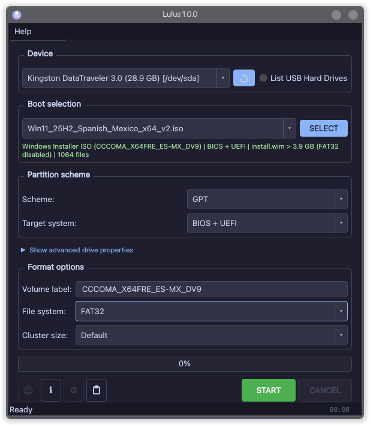

# Lufus

A native Linux application for creating bootable USB drives from Windows and Linux ISO images. Developed as a functional port of [Rufus](https://rufus.ie), originally built for Windows.




---

## Features

- Windows 10 and Windows 11 (including 25H2) ISO support
- Linux ISO support
- UEFI and legacy BIOS compatibility
- Secure Boot support
- Automatic `install.wim` splitting for FAT32 and Windows 11 and 10 compatibility
- GPT partition scheme with correct Microsoft basic data partition type
- UDisks2-based authentication — no `pkexec` required
- Flatpak support

---

## Installation

### Flatpak (recommended)

> Flathub submission in progress.

Once available on Flathub:

```bash
flatpak install flathub io.github.lufus.Lufus
flatpak run io.github.lufus.Lufus
```

### Build from source

#### Dependencies

- Qt6 (Widgets, Core, DBus, Concurrent, SvgWidgets)
- CMake 3.20+
- GCC or Clang with C++17 support
- libblkid, libfdisk, libuuid (util-linux)
- libcurl
- libudev
- wimlib
- polkit

On Fedora:

```bash
sudo dnf install qt6-qtbase-devel qt6-qtsvg-devel cmake gcc-c++ \
    pkgconfig libudev-devel libcurl-devel util-linux-devel \
    wimlib-utils polkit-devel
```

On Debian/Ubuntu:

```bash
sudo apt install qt6-base-dev qt6-svg-dev cmake g++ pkg-config \
    libudev-dev libcurl4-openssl-dev libblkid-dev libfdisk-dev \
    libuuid1 wimtools libpolkit-gobject-1-dev
```

#### Compile

```bash
git clone https://github.com/Ricky182771/Lufus.git
cd Lufus
mkdir build && cd build
cmake ..
make -j$(nproc)
```

#### Install polkit policy (required for device writing)

```bash
sudo cp polkit/io.github.lufus.Lufus.policy \
    /usr/share/polkit-1/actions/
sudo systemctl restart polkit
```

#### Run

```bash
./build/Lufus
```

---

## Usage

1. Connect a USB drive (8 GB or larger recommended)
2. Click **SELECT** and choose a Windows or Linux ISO
3. Select partition scheme and target system
4. Click **START**
5. Authenticate when prompted by the system
6. Wait for the process to complete

For Windows 11 ISOs, Lufus automatically splits `install.wim` into
FAT32-compatible segments using wimlib. No manual configuration required.


## License

GNU General Public License v3.0 — see [LICENSE](LICENSE) for details.

This project is based on [Rufus](https://github.com/pbatard/rufus) by Pete Batard,
also licensed under GPL-3.0.
